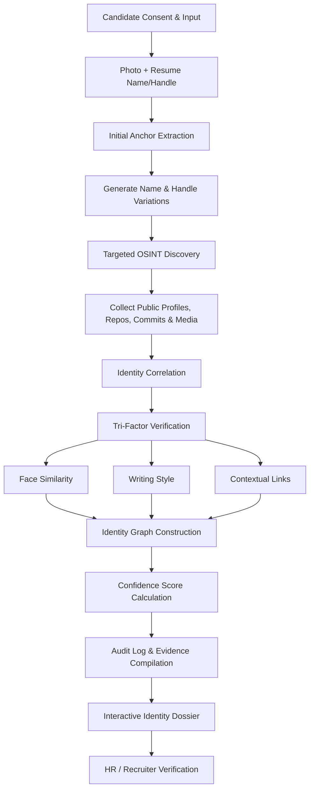

# Neurax3.0-Tech-Titans
# Identity Intelligence Engine

**AI-powered OSINT for fast, verifiable identity lookups**

> Built for **Neurax Hackathon 3.0** — Domain 3: AI in Cybersecurity

---

## The Problem

A person's digital footprint is scattered across GitHub, LinkedIn, personal portfolios, academic repositories, and conference speaker lists — often under different usernames, aliases, or spellings. When an organization only has a small starting point (a photo, a name, a company), piecing together a verified picture of that person is slow and error-prone:

| Who's affected | The pain point |
|---|---|
| **Organizations & Verification Teams** | Manual identity checks are slow, tedious, and easy to get wrong |
| **Trust & Security Teams** | Exposed to insider threats and spoofed or impersonated identities |
| **Individuals** | Have no easy way to have their scattered, genuine public presence quickly and accurately confirmed |

Fragmented, inconsistent identifiers make it easy for bad actors to hide behind misleading or fabricated profiles — and hard for legitimate identities to be confirmed quickly.

---

## Our Solution

An autonomous **OSINT (Open-Source Intelligence) Identity Verification System**. A user submits a small seed of information — a photo plus basic details like name and company — and the system automatically discovers, correlates, and verifies that person's fragmented public footprint into a single, evidence-backed identity dossier for the requesting organization.

---

## How It Works

### 1. Initial Anchor Extraction
The consented candidate photo is converted into a facial embedding vector, while resume data is used to generate likely name and handle variations.

- **Tools:** `InsightFace`, `OpenCV`

### 2. Targeted OSINT Discovery
Using those anchors, the system queries authorized public APIs, code repositories, and professional registries to harvest publicly accessible bios, commits, and media.

- **Tools:** `Python`, `FastAPI`

### 3. Identity Correlation & Verification
Rather than returning a raw list of links, discovered accounts are cross-referenced through a **Tri-Factor Verification** test:

- **Facial similarity**
- **Writing style analysis**
- **Contextual links** between profiles

- **Tools:** `NetworkX` (identity graph), local SLMs via `Ollama` / `Llama-3` (linguistic analysis)

### 4. Audit Reporting & Confidence Scoring
Verified identities are merged into a weighted trust score and compiled into an immutable audit log with direct source URLs — so HR teams can see exactly *why* an account was linked to a candidate.

- **Tools:** `Pydantic` (structured audit logs), `Streamlit` / `Next.js` (interactive frontend)

---

## Tech Stack

| Layer | Technology |
|---|---|
| Computer Vision / Biometrics | InsightFace, OpenCV |
| Backend / Data Collection | Python, FastAPI |
| Graph & Relationship Mapping | NetworkX |
| Language Analysis | Ollama, Llama-3 (local SLMs) |
| Data Validation | Pydantic |
| Frontend | Streamlit or Next.js |

---

## Ethics & Compliance

This system is built around a strict consent-first, rights-respecting design:

- Operates only on **public, consented, and authorized** information
- No bypassing of access controls
- No use of leaked or breached databases
- Respects all platform rate limits and privacy guardrails

---

## Impacted Audiences

- **Corporate HR & Recruitment Teams** — faster, more reliable candidate vetting
- **Enterprise Trust & Security Teams** — reduced exposure to insider threats and identity spoofing
- **Job Seekers & Professionals** — a fast, verifiable way to showcase authentic accomplishments

---

## Status

Prototype built for Neurax Hackathon 3.0 (Domain 3: AI in Cybersecurity).
