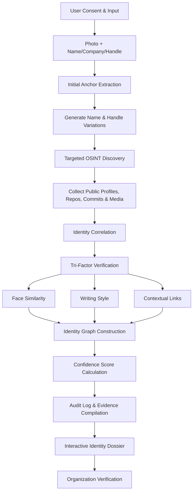

# Neurax3.0-Tech-Titans
## The Problem

A person's digital footprint is scattered across GitHub, LinkedIn, personal portfolios, academic repositories, and conference speaker lists — often under different usernames, aliases, or spellings. When an organization only has a small starting point (a photo, a name, a company), piecing together a verified picture of that person is slow and error-prone:

| Who's affected | The pain point |
|---|---|
| **Organizations & Verification Teams** | Manual identity checks are slow, tedious, and easy to get wrong |
| **Trust & Security Teams** | Exposed to insider threats and spoofed or impersonated identities |
| **Individuals** | Have no easy way to have their scattered, genuine public presence quickly and accurately confirmed |

Fragmented, inconsistent identifiers make it easy for bad actors to hide behind misleading or fabricated profiles — and hard for legitimate identities to be confirmed quickly.

---

## Our Solution

An autonomous **OSINT (Open-Source Intelligence) Identity Verification System**. A user submits a small seed of information — a photo plus basic details like name and company — and the system automatically discovers, correlates, and verifies that person's fragmented public footprint into a single, evidence-backed identity dossier for the requesting organization.

What sets this apart from a simple rules-based lookup is a layer of custom AI woven through the pipeline: a **custom-trained fusion model** learns how to weigh and combine facial similarity, writing style, and contextual signals into one calibrated trust score, rather than relying on a hand-tuned average. An **adaptive query agent** reasons about where to search next — spotting a mentioned employer or project in one profile and automatically generating new, targeted OSINT queries around it. Profile bios, posts, and commit messages are embedded into a shared vector space for **semantic matching**, so the system recognizes the same person even when names or wording differ across platforms. A dedicated **anomaly detection** model flags contradictions across sources — conflicting employers, timelines, or claimed skills — for human review instead of silently averaging them away. And verifier decisions feed back into the system, letting the fusion model's weighting **continuously improve** over time.

---

## How It Works

### 1. Initial Anchor Extraction
The consented photo is converted into a facial embedding vector, while the basic details supplied (name, company, handle, etc.) are used to generate likely name and handle variations.

- **Tools:** `InsightFace`, `OpenCV`

### 2. Targeted OSINT Discovery
Using those anchors, the system queries authorized public APIs, code repositories, and professional registries to harvest publicly accessible bios, commits, and media.

- **Tools:** `Python`, `FastAPI`

### 3. Identity Correlation & Verification
Rather than returning a raw list of links, discovered accounts are cross-referenced through a **Tri-Factor Verification** test:

- **Facial similarity**
- **Writing style analysis**
- **Contextual links** between profiles

- **Tools:** `NetworkX` (identity graph), local SLMs via `Ollama` / `Llama-3` (linguistic analysis)

### 4. Audit Reporting & Confidence Scoring
Verified identities are merged into a weighted trust score and compiled into an immutable audit log with direct source URLs — so the requesting organization can see exactly *why* an account was linked to the individual.

- **Tools:** `Pydantic` (structured audit logs), `Streamlit` / `Next.js` (interactive frontend)

---

## Additional AI Innovations

Beyond the core pipeline, we layer in a few custom AI components to make matching smarter and more resilient than a simple rules-based lookup:

- **Custom Fusion Model** — Rather than treating face similarity, writing style, and contextual links as three separate scores, we train a lightweight custom model that learns how to weigh and combine these signals together, producing a single calibrated trust score instead of a hand-tuned average.
- **Adaptive Query Agent** — An LLM-driven agent that reasons about *where* to search next based on what it has already found — for example, spotting a mentioned employer or project in one profile and automatically generating new, targeted OSINT queries around it, rather than following a fixed search list.
- **Semantic Profile Matching** — Profile bios, posts, and commit messages are embedded into a shared vector space so the system can recognize the *same person* even when names, handles, or wording differ significantly across platforms.
- **Anomaly & Inconsistency Detection** — A dedicated model flags contradictions across discovered sources (e.g. conflicting employers, timelines, or claimed skills), surfacing potential fraud signals for human review instead of silently averaging them away.
- **Self-Improving Feedback Loop** — Verifier decisions (confirmed / rejected matches) are fed back into the system to continuously refine the fusion model's weighting over time.

---

## Tech Stack

| Layer | Technology |
|---|---|
| Computer Vision / Biometrics | InsightFace, OpenCV |
| Backend / Data Collection | Python, FastAPI |
| Graph & Relationship Mapping | NetworkX |
| Language Analysis | Ollama, Llama-3 (local SLMs) |
| Custom Fusion & Scoring Model | Custom-trained model (in-house) |
| Data Validation | Pydantic |
| Frontend | Streamlit or Next.js |

---

## Ethics & Compliance

This system is built around a strict consent-first, rights-respecting design. It works only with information the user has explicitly agreed to submit, and every finding traces back to a public source:

- Operates only on **public, consented, and authorized** information
- No bypassing of access controls
- No use of leaked or breached databases
- Respects all platform rate limits and privacy guardrails

---

## Impacted Audiences

- **Organizations & Verification Teams** — faster, more reliable identity checks with minimal input
- **Enterprise Trust & Security Teams** — reduced exposure to insider threats and identity spoofing
- **Individuals** — a fast, verifiable way to confirm their genuine public presence

---

## Status

Prototype built for Neurax Hackathon 3.0 (Domain 3: AI in Cybersecurity).
